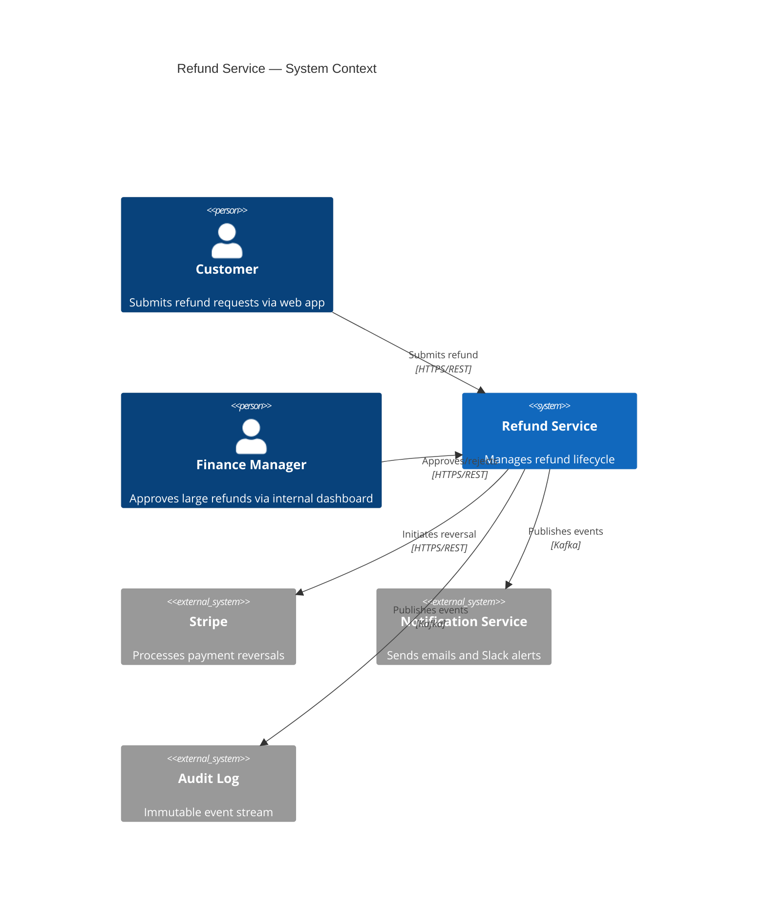
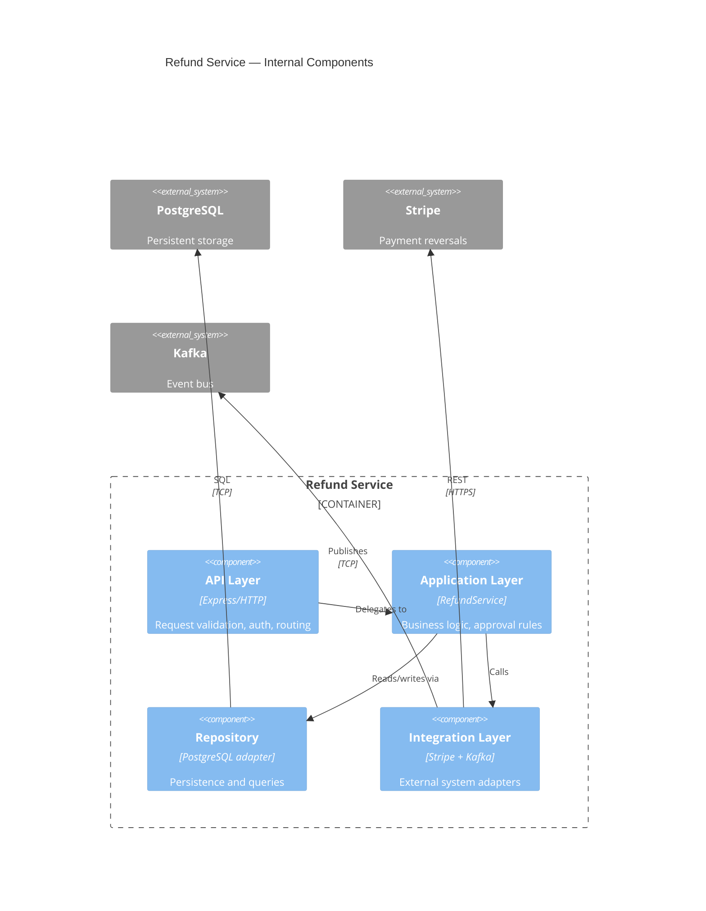
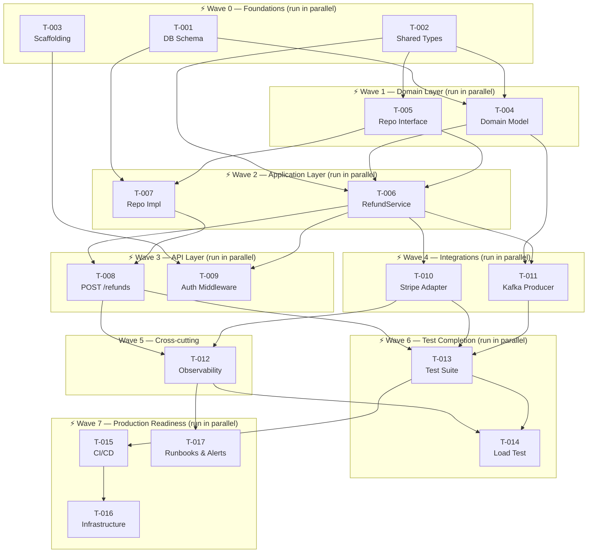

# Artifact Templates Reference

Full templates and examples for all 7 SDD artifact categories. Load this file when the user needs a concrete template or example for a specific artifact type.

---

## Table of Contents

1. [Vision & Scope Templates](#1-vision--scope-templates)
2. [Behavioral Specification Templates](#2-behavioral-specification-templates)
3. [Interface & Contract Templates](#3-interface--contract-templates)
4. [Acceptance & Test Specification Templates](#4-acceptance--test-specification-templates)
5. [Architecture & Design Templates](#5-architecture--design-templates)
6. [Governance Templates](#6-governance-templates)
7. [Planning & Traceability Templates](#7-planning--traceability-templates)
8. [Implementation Plan Templates](#8-implementation-plan-templates)

---

## 1. Vision & Scope Templates

### Problem Statement (Section 1)

```markdown
## 1. Problem Statement

**Business problem:** [One sentence: what is broken or missing for the business?]

**Target users:** [Role, context, frequency of use. E.g.: "Operations analysts who process ~200 refund requests/day via the internal dashboard."]

**Current state / pain:** [What do users do today? What breaks or is slow?]

**Desired outcome:** [Observable improvement. Written as a user or business outcome, not a feature.]

**Success criteria (measurable):**
| Metric | Baseline | Target | Measurement method |
|--------|----------|--------|-------------------|
| [e.g. Activation rate] | [e.g. 12%] | [e.g. ≥ 30%] | [e.g. Amplitude funnel event] |
| [e.g. P99 API latency] | [e.g. 850 ms] | [e.g. ≤ 200 ms] | [e.g. Prometheus histogram] |
```

### Scope & Non-Goals (Section 2)

```markdown
## 2. Scope & Non-Goals

### In scope for this iteration
- [Behavior 1 — specific, not vague]
- [Behavior 2]
- [Behavior 3]

### Out of scope (non-goals)
<!-- MANDATORY. Empty non-goals section = AI agents treat everything as in scope. -->
- [Feature / behavior X — explicitly excluded and why, or "deferred to v2"]
- [Integration with system Y — not in this iteration]
- [Performance optimization Z — tracked in separate ticket PERF-42]
```

### Decision Log (Section 3)

```markdown
## 3. Stakeholders & Decision Log

| Role | Name / Team | Responsibilities |
|------|-------------|-----------------|
| Product owner | @name | Problem statement, scope sign-off |
| Tech lead | @name | Architecture, contract sign-off |
| Security | @team | Compliance checklist sign-off |

| Date | Decision | Rationale | Decided by |
|------|----------|-----------|------------|
| YYYY-MM-DD | [Decision text] | [Why this option over alternatives] | @name |
```

---

## 2. Behavioral Specification Templates

### EARS Notation Guide

EARS (Easy Approach to Requirements Syntax) provides five templates for unambiguous natural-language requirements. Use these instead of free-form prose.

| Pattern | Template | When to use |
|---------|----------|-------------|
| Ubiquitous | `The [system] shall [behavior].` | Always-active behaviors |
| Event-driven | `When [trigger], the [system] shall [behavior].` | Response to an event |
| State-driven | `While [state], the [system] shall [behavior].` | Behavior active during a condition |
| Unwanted | `If [unwanted condition], then the [system] shall [response].` | Error handling and guards |
| Optional | `Where [feature flag is enabled], the [system] shall [behavior].` | Feature-flagged behaviors |

**Examples:**
- ✅ `When a refund request is submitted with amount > $500, the system shall require manager approval before processing.`
- ✅ `If the payment provider returns a 5xx error, then the system shall retry up to 3 times with exponential backoff before returning a failure response.`
- ❌ `The system should handle large refunds appropriately.` (vague, untestable)

### Functional Requirement (FR) Template

```markdown
**FR-NNN: [Short, descriptive title]**
- **Inputs:** [Exact data, signals, or events that trigger this behavior. Include types and constraints, e.g. "amount: decimal ≥ 0.01"]
- **Preconditions:** [System state that must be true. E.g. "User is authenticated", "Order is in PENDING state"]
- **Behavior:** [What the system must do. Use EARS patterns. Be unambiguous about ordering if multiple steps.]
- **Outputs / side effects:** [Observable outcomes: return values, state mutations, events emitted, notifications sent]
- **Error cases:**
  - If [condition A]: [response A — be specific: HTTP status, error code, retry behavior]
  - If [condition B]: [response B]
- **Priority:** Must / Should / Could (MoSCoW)
- **Linked AC:** AC-NNN [comma-separated if multiple]
- **Notes:** [Optional: implementation hints, open questions, links to related FRs]
```

**Example:**

```markdown
**FR-007: Process refund request**
- **Inputs:** `refund_request_id: UUID`, `requested_by: user_id`, `reason: string (max 500 chars)`
- **Preconditions:** User is authenticated. Order status is DELIVERED or PARTIALLY_DELIVERED. Refund has not already been issued for this order.
- **Behavior:** When a refund request is submitted, the system shall validate the request, calculate the refund amount against the original order total, and if amount ≤ $500 approve automatically; if amount > $500 create a pending approval task assigned to the requester's manager.
- **Outputs / side effects:** `RefundRequest` record created with status APPROVED or PENDING_APPROVAL. `refund.requested` event emitted to the audit event stream.
- **Error cases:**
  - If order is not in DELIVERED or PARTIALLY_DELIVERED state: return 422 with error code `INVALID_ORDER_STATE`
  - If refund already exists for order: return 409 with error code `DUPLICATE_REFUND`
  - If user is not authenticated: return 401
- **Priority:** Must
- **Linked AC:** AC-012, AC-013, AC-014
```

### NFR Table (mandatory format)

```markdown
## 6. Non-Functional Requirements

| ID | Category | Requirement | Measurement method | Threshold | SLO / target |
|----|----------|-------------|-------------------|-----------|--------------|
| NFR-001 | Latency | Refund submission API P99 response time | Prometheus `http_request_duration_seconds` histogram | ≤ 200 ms | 99.9% of requests |
| NFR-002 | Latency | Manager approval notification delivery | Event stream consumer lag | ≤ 30 s end-to-end | 99% of events |
| NFR-003 | Availability | Refund service uptime | Uptime monitor (synthetic probe) | ≥ 99.9% | Monthly |
| NFR-004 | Throughput | Peak refund submissions | Load test at 2x peak | 500 req/s sustained | No degradation |
| NFR-005 | Data residency | PII stored only in EU region | Config audit | All PII in `eu-west-1` | Always |
| NFR-006 | Security | All refund mutations require RBAC role `refund:write` | Auth middleware unit test | 100% enforced | Always |
```

### Business Rules & Edge Cases (Section 7)

```markdown
## 7. Business Rules & Edge Cases

### Business rules
| ID | Rule | Source |
|----|------|--------|
| BR-001 | Auto-approval threshold is $500 USD; configurable per tenant via `REFUND_AUTO_APPROVE_LIMIT` env var | Finance policy v3.2 |
| BR-002 | Manager is determined by `users.manager_id` FK; if null, escalate to `finance_ops@company.com` | HR system integration |
| BR-003 | Refunds must be processed within 5 business days of approval | SLA agreement |

### Edge cases to handle explicitly
| Case | Expected behavior |
|------|------------------|
| Order is fully refunded, second refund requested | Return 409 DUPLICATE_REFUND |
| `manager_id` is null for requester | Route to `finance_ops@company.com` and log warning |
| Payment provider down during auto-approval | Transition to PENDING_PAYMENT state; retry job picks up within 60 s |
| Refund amount > original order total | Return 422 AMOUNT_EXCEEDS_ORDER with max refundable amount in response body |
| User submits refund from suspended account | Return 403 ACCOUNT_SUSPENDED before any processing |
| Concurrent duplicate submissions (race condition) | DB unique constraint on `(order_id, status ≠ REJECTED)`; second request returns 409 |
```

---

## 3. Public Interface Templates

The public interfaces contract (`specs/contracts/interfaces.md`) is a single markdown file covering every boundary that an external caller or implementing class must conform to. This includes web API endpoints (REST, gRPC, GraphQL), application service interfaces, and repository interfaces. Each interface is described in prose first; schemas and signatures are embedded as supplementary code blocks.

### Public Interface Contract (specs/contracts/interfaces.md)

The contract file is markdown. The prose description is the primary artifact; schemas and signatures are embedded as supplementary code blocks. Both must be present.

The file is structured in three parts: **Web API interfaces** (HTTP endpoints, gRPC services, GraphQL types), **Code interfaces** (service and repository interfaces that concrete classes implement), and **External integration contracts** (third-party dependencies). Include only the parts relevant to the feature.

````markdown
# Public Interfaces: [Feature Name]
_Version: 1.0 | Status: Accepted | Implements: FR-NNN_

## Web API Interfaces

### POST /refunds — Submit a refund request

**Purpose:** Create a new refund request for a delivered order.
**Auth:** JWT bearer token; role `refund:write` required.
**Implements:** FR-007, AC-012 through AC-015.

**Request fields:**

| Field | Type | Required | Constraints |
|-------|------|----------|-------------|
| `order_id` | UUID | Yes | Must reference an existing order |
| `reason` | string | Yes | Max 500 characters |

**Response codes:**

| Status | Condition | Body |
|--------|-----------|------|
| 201 Created | Refund created | `RefundResponse` object |
| 409 Conflict | Duplicate refund exists for this order | `{error_code: "DUPLICATE_REFUND", request_id}` |
| 422 Unprocessable | Validation error | `{error_code, field, message, request_id}` |
| 401 Unauthorized | Missing or invalid token | `{error_code: "UNAUTHORIZED"}` |
| 403 Forbidden | Valid token, insufficient role | `{error_code: "FORBIDDEN"}` |

**OpenAPI schema (supplementary):**

```yaml
openapi: 3.1.0
info:
  title: Refund Service API
  version: 1.0.0
paths:
  /refunds:
    post:
      operationId: createRefundRequest
      requestBody:
        required: true
        content:
          application/json:
            schema:
              $ref: '#/components/schemas/RefundRequest'
      responses:
        '201':
          description: Refund created
        '409':
          $ref: '#/components/responses/DuplicateRefund'
        '422':
          $ref: '#/components/responses/ValidationError'
components:
  schemas:
    RefundRequest:
      type: object
      required: [order_id, reason]
      properties:
        order_id: { type: string, format: uuid }
        reason: { type: string, maxLength: 500 }
```

---

## Code Interfaces

### IRefundService

**Purpose:** Application service interface; implemented by `RefundService`, injected into the API layer and tests.
**Implemented by:** `src/refund/RefundService.ts` (T-006)
**Consumed by:** `src/api/RefundController.ts` (T-008)

| Method | Parameters | Returns | Behaviour |
|--------|------------|---------|-----------|
| `createRefund` | `input: CreateRefundInput` | `Promise<RefundResponse>` | Validates, computes amount, applies approval logic |
| `getRefundById` | `id: UUID` | `Promise<RefundResponse \| null>` | Returns refund or null if not found |

**TypeScript signature (supplementary):**

```typescript
interface IRefundService {
  createRefund(input: CreateRefundInput): Promise<RefundResponse>;
  getRefundById(id: string): Promise<RefundResponse | null>;
}
```

### IRefundRepository

**Purpose:** Repository interface; isolates application layer from persistence details.
**Implemented by:** `src/refund/RefundRepository.ts` (T-007)
**Consumed by:** `RefundService` (T-006)

| Method | Parameters | Returns | Behaviour |
|--------|------------|---------|-----------|
| `create` | `input: CreateRefundInput` | `Promise<RefundRequest>` | Inserts record; throws on duplicate |
| `findById` | `id: UUID` | `Promise<RefundRequest \| null>` | Returns record or null |
| `findByOrderId` | `orderId: UUID` | `Promise<RefundRequest \| null>` | Returns active (non-REJECTED) refund or null |
| `updateStatus` | `id: UUID, status: RefundStatus, version: number` | `Promise<RefundRequest>` | Optimistic-lock update; throws `StaleVersionError` on conflict |

**TypeScript signature (supplementary):**

```typescript
interface IRefundRepository {
  create(input: CreateRefundInput): Promise<RefundRequest>;
  findById(id: string): Promise<RefundRequest | null>;
  findByOrderId(orderId: string): Promise<RefundRequest | null>;
  updateStatus(id: string, status: RefundStatus, version: number): Promise<RefundRequest>;
}
```

---

## External Integration Contracts

### Stripe (Payment Reversals)

| Property | Value |
|----------|-------|
| Rate limit | 100 req/s per API key; enforce client-side throttle at 80 req/s |
| Error semantics | 4xx = do not retry; 5xx = retry with exponential backoff, max 3 attempts |
| Idempotency | Supply `Idempotency-Key: {refund_request_id}` on all mutation requests |
| Timeout | Hard timeout at 5 s; treat as transient error (retry-eligible) |
| Fallback | After 3 retries: set status=PENDING_PAYMENT, enqueue retry job |
| Webhook security | Verify `Stripe-Signature` header on all incoming webhooks; reject if invalid |
````

### Domain Model Template

```markdown
# specs/contracts/domain.md

## Domain Model

### Entities and Aggregates

**RefundRequest** (aggregate root)
- `id: UUID` (PK)
- `order_id: UUID` (FK → Orders)
- `requested_by: UUID` (FK → Users)
- `amount: Decimal` (computed from order; not user-supplied)
- `status: Enum(PENDING_APPROVAL, APPROVED, PENDING_PAYMENT, PAID, REJECTED)`
- `created_at: Timestamp`
- `approved_at: Timestamp?`
- `approved_by: UUID?`

**Invariants:**
- A RefundRequest cannot transition from PAID or REJECTED (terminal states)
- `amount` must be ≤ original order total at time of request
- Only one non-REJECTED RefundRequest may exist per `order_id`

### Event Definitions

| Event | Producer | Consumers | Schema section |
|-------|----------|-----------|----------------|
| `refund.requested` | Refund Service | Audit log, Notification Service | See `events.md §RefundRequested` |
| `refund.approved` | Refund Service | Payment Service, Notification Service | See `events.md §RefundApproved` |
| `refund.paid` | Payment Service | Refund Service, Finance Reporting | See `events.md §RefundPaid` |

**Semantic guarantees:** at-least-once delivery; all consumers must be idempotent on `refund_request_id`.

Event payload schemas are defined in `specs/contracts/events.md` as embedded code blocks. Example:

````markdown
# Event Contracts: Refund Service
_Version: 1.0 | Implements: FR-007_

## Overview

All events are published to the `refund-events` Kafka topic.
Delivery guarantee: at-least-once. All consumers must implement idempotency keyed on `refund_request_id`.

## RefundRequested

**Emitted:** immediately when a RefundRequest is created, before approval processing.
**Producer:** Refund Service
**Consumers:** Audit Log Service, Notification Service

| Field | Type | Description |
|-------|------|-------------|
| `event_type` | string | `"refund.requested"` |
| `refund_request_id` | UUID | Idempotency key for consumers |
| `order_id` | UUID | The order being refunded |
| `requested_by` | UUID | User who submitted the request |
| `amount` | decimal | Computed refund amount |
| `timestamp` | ISO 8601 | When the event was emitted |

```json
{
  "event_type": "refund.requested",
  "refund_request_id": "uuid",
  "order_id": "uuid",
  "requested_by": "uuid",
  "amount": "150.00",
  "timestamp": "2026-01-01T12:00:00Z"
}
```
````
```

---

## 4. Acceptance & Test Specification Templates

### Acceptance Criteria Template

```markdown
**AC-NNN** | Links to: FR-NNN | Priority: P0 / P1 / P2

- **Given** [system is in a specific state]
- **When** [actor performs a specific action, or system event occurs]
- **Then** [primary observable outcome]
- **And** [secondary observable outcome, if any]
```

**Example:**

```markdown
**AC-012** | Links to: FR-007 | Priority: P0

- **Given** a user with role `customer` is authenticated and order ORD-123 is in DELIVERED state with no existing refund
- **When** the user submits a refund request for ORD-123 with amount $150
- **Then** the system creates a RefundRequest with status APPROVED
- **And** emits a `refund.requested` event followed by a `refund.approved` event to the audit stream
- **And** returns HTTP 201 with the created RefundRequest including `status: "APPROVED"`
```

### Scenario Catalog Template

```markdown
## 8. Scenario Catalog

| ID | Type | Scenario | Input | Expected outcome | Links |
|----|------|----------|-------|-----------------|-------|
| SC-001 | Positive | Auto-approve small refund | amount=$100, order=DELIVERED | Status=APPROVED, HTTP 201 | FR-007, AC-012 |
| SC-002 | Positive | Manual-approve large refund | amount=$600, order=DELIVERED | Status=PENDING_APPROVAL, task created | FR-007, AC-013 |
| SC-003 | Negative | Duplicate refund attempt | Existing APPROVED refund exists | HTTP 409, DUPLICATE_REFUND | FR-007, AC-014 |
| SC-004 | Negative | Invalid order state | order=CANCELLED | HTTP 422, INVALID_ORDER_STATE | FR-007, AC-015 |
| SC-005 | Edge | Race: concurrent duplicate submissions | Two simultaneous requests, same order | One 201, one 409 | FR-007, BR-001 |
| SC-006 | Edge | Null manager_id | requester has no manager | Task routed to finance_ops, warning logged | BR-002 |
| SC-007 | Negative | Payment provider down | Stripe returns 503 | Status=PENDING_PAYMENT after 3 retries | NFR-003 |
```

---

## 5. Architecture & Design Templates

### System Diagrams (specs.md §10)

Diagrams live inside `specs.md §10` as Mermaid code blocks. Each diagram must be preceded by a complete text description — the text is the primary artifact, the diagram is supplementary. The spec must be fully readable without rendering the Mermaid.

````markdown
## 10. System Diagrams

### Context: System boundary and external actors

The Refund Service sits between the customer-facing web application and three external systems.
Customers submit refund requests via HTTPS. Finance managers approve or reject requests via
an internal dashboard, also over HTTPS. Approved refunds are forwarded to Stripe for payment
reversal. All state transitions are published as events to two consumers: the Notification
Service (which sends emails and Slack alerts) and the Audit Log (an immutable event stream).
No external system has write access to the Refund Service's database.



### Components: Internal structure of the Refund Service

The Refund Service is composed of four internal layers. The API layer receives and validates
HTTP requests, enforces authentication and RBAC, and delegates to the Application layer.
The Application layer contains the RefundService use case, which orchestrates approval logic,
coordinates with the Repository, and emits domain events. The Repository layer translates
between the domain model and the PostgreSQL database. The Integration layer wraps Stripe
(for payment reversals) and the Kafka producer (for event emission), and is the only layer
permitted to call external systems.


````

### Design Decisions Template (Section 9)

```markdown
## 9. Architecture & Design Decisions

| ID | Decision | Rationale | Alternatives rejected |
|----|----------|-----------|----------------------|
| DD-001 | Use optimistic locking (version field) to prevent concurrent duplicate refunds | Simpler than distributed lock; race window is sub-second | Distributed lock (Redis): adds operational dependency; pessimistic DB lock: contention under load |
| DD-002 | Emit `refund.requested` event before processing, not after | Enables audit trail even for failed requests; aligns with event-sourcing patterns used in Orders domain | Emit only on success: loses failure audit trail |
| DD-003 | Manager approval via async task queue, not synchronous call | Managers may not be online; decouples approval SLA from API response time | Synchronous: blocks API response for human action |
```

### Operational & Failure Behavior (Section 11)

```markdown
## 11. Operational & Failure Behavior

### Failure modes

| Failure | Detection | System behavior | Recovery |
|---------|-----------|-----------------|----------|
| Stripe 5xx | HTTP status | Retry up to 3× with exponential backoff; after 3: set status=PENDING_PAYMENT, enqueue retry job | Retry job runs every 60 s; max 24 h before paging on-call |
| Kafka unavailable | Producer exception | Refund mutation is rolled back; return 503 to caller | Retry with circuit breaker; alert if down > 5 min |
| DB primary failover | Connection error | Retry reads from replica; writes queue for up to 30 s | Auto-failover; alert on manual if >30 s |

### Observability requirements

| Signal | What to emit | Tool |
|--------|-------------|------|
| Metric | `refund_requests_total{status, amount_tier}` | Prometheus counter |
| Metric | `refund_processing_duration_seconds` | Prometheus histogram (P50, P95, P99) |
| Log | Structured log on every state transition: `{refund_id, from_state, to_state, actor, timestamp}` | JSON to stdout → Datadog |
| Trace | Distributed trace spanning submission → Stripe → event emission | OpenTelemetry |
| Alert | P99 latency > 300 ms for 5 min | PagerDuty |
| Alert | Error rate > 1% for 5 min | PagerDuty |
```

---

## 6. Governance Templates

*(See `ai-guardrails.md` for the full engineering constitution template and AI-specific guardrail patterns.)*

### Security & Compliance Checklist (Section 13)

```markdown
## 13. Security & Compliance

- [ ] Data classification: Does this feature handle PII or financial data? → Yes (order amounts, customer IDs)
- [ ] Data residency: All PII must be stored in `eu-west-1` per policy DRP-2024
- [ ] Auth: All endpoints protected by RBAC; required role documented per FR
- [ ] Audit: All mutations emit to immutable audit event stream (FR-007)
- [ ] Input validation: All user-supplied strings sanitized and length-bounded (FR template error cases)
- [ ] Secrets: No secrets in code or env files; use Vault at path `secret/refund-service/*`
- [ ] Dependency: No new direct DB calls from UI layer (see guardrails doc)
- [ ] Threat model: Is this feature a candidate for a formal threat model review? → No (low risk, no new attack surface)
- [ ] Regulatory: Any GDPR / PCI-DSS implications? → PCI: payment data remains with Stripe, not stored locally
- [ ] Required approvals before release: Security review sign-off (for features handling payment data)
```

---

## 8. Implementation Plan Templates

The implementation plan (`specs/implementation-plan.md`) is produced after the spec is accepted. It decomposes the entire spec into atomic tasks organized into concurrent execution waves, from project scaffolding through production deployment.

### File header

```markdown
# Implementation Plan: [Feature Name]
_Spec version: 1.0 | Plan version: 1.0 | Owner: @name | Status: Draft_
_Spec: [specs/specs.md](specs.md)_

## Concurrency model
Tasks within the same wave have no mutual dependencies and may be executed by separate agents simultaneously.
Waves are hard synchronization points: all tasks in Wave N must be verified complete before Wave N+1 begins.

## Legend
| Symbol | Meaning |
|--------|---------|
| ⬜ Pending | Not started |
| 🔵 In Progress | Agent actively working |
| ✅ Complete | Done; outputs committed |
| 🔴 Blocked | Waiting on dependency |
```

### Task Registry table

```markdown
## Task Registry

| Task ID | Wave | Name | Implements | Depends on | Status | Est. |
|---------|------|------|------------|------------|--------|------|
| T-001 | 0 | DB schema migration | FR-007 | — | ⬜ | 2h |
| T-002 | 0 | Shared types & interfaces | FR-007 | — | ⬜ | 1h |
| T-003 | 0 | Project scaffolding & config | — | — | ⬜ | 1h |
| T-004 | 1 | RefundRequest domain model | FR-007, BR-001 | T-001, T-002 | ⬜ | 2h |
| T-005 | 1 | RefundRepository interface | FR-007 | T-002 | ⬜ | 1h |
| T-006 | 2 | RefundService use case | FR-007, BR-001, BR-002 | T-004, T-005 | ⬜ | 3h |
| T-007 | 2 | RefundRepository implementation | FR-007 | T-001, T-005 | ⬜ | 2h |
| T-008 | 3 | POST /refunds endpoint | FR-007, AC-012 | T-006, T-007 | ⬜ | 2h |
| T-009 | 3 | Auth middleware integration | NFR-006 | T-003, T-006 | ⬜ | 1h |
| T-010 | 4 | Stripe adapter | FR-007, NFR-003 | T-006 | ⬜ | 3h |
| T-011 | 4 | Kafka event producer | FR-007 | T-004, T-006 | ⬜ | 2h |
| T-012 | 5 | Observability: metrics & traces | NFR-001, NFR-002 | T-008, T-010 | ⬜ | 2h |
| T-013 | 6 | Unit & integration test suite | AC-012–AC-015, SC-001–SC-007 | T-008, T-010, T-011 | ⬜ | 4h |
| T-014 | 6 | Load test & NFR validation | NFR-001, NFR-004 | T-012, T-013 | ⬜ | 2h |
| T-015 | 7 | CI/CD pipeline | — | T-013 | ⬜ | 2h |
| T-016 | 7 | Infrastructure-as-code | NFR-002, NFR-005 | T-015 | ⬜ | 3h |
| T-017 | 7 | Runbooks & alert rules | Section 11 | T-012, T-015 | ⬜ | 2h |
```

### Dependency graph (Mermaid DAG)

```markdown
## Dependency Graph


```

### Per-task brief template

```markdown
---

### Task T-NNN: [Name]

| | |
|---|---|
| **Wave** | N |
| **Status** | ⬜ Pending |
| **Estimate** | Xh |
| **Implements** | FR-NNN, AC-NNN — [brief description of what spec requirement this satisfies] |
| **Depends on** | T-NNN (must be ✅ Complete before this task starts) |

**Objective:** [One sentence. What exists when this task is done that did not exist before.]

**Authorized files** *(agent must not create or modify any file not listed here)*
- `src/path/to/file.ts` — [what this file contains / why it belongs to this task]
- `src/path/to/other.ts` — [purpose]
- `tests/path/to/file.test.ts` — unit tests for the above

**Inputs from prior waves** *(these must be committed and ✅ before this task starts)*
- `src/path/to/Interface.ts` — exports `IRefundRepository`; this task implements it
- `db/migrations/001_create_refunds.sql` — schema must be applied to test DB

**Outputs / contracts** *(what this task produces that later tasks depend on)*
- `src/path/to/file.ts` — exports `RefundService`; consumed by T-008, T-009
- Event: `refund.requested` schema committed to `specs/contracts/events.json`

**Definition of done** *(all must be true before marking ✅ Complete)*
- [ ] All authorized files created or modified; no files outside the list touched
- [ ] [Specific behavioral condition tied to the FR, e.g. "Auto-approval triggers for amount ≤ threshold"]
- [ ] [Specific behavioral condition, e.g. "PENDING_APPROVAL state created for amount > threshold"]
- [ ] Unit tests pass: `[test file path]` — covers AC-NNN, SC-NNN
- [ ] No git commands run; source control left to the human

**Ambiguity protocol:** If any detail is unclear while executing this task, stop immediately and ask the human a yes/no question. Do not infer, guess, or proceed under uncertainty.
```

### Wave gate checklist template

Insert one of these between each wave in the implementation plan:

```markdown
---

## 🔒 Wave N Gate — [Wave Name]

*All tasks in Wave N must be ✅ Complete before this gate is reviewed.*

- [ ] Every Wave N task is marked ✅ Complete
- [ ] No authorized file from Wave N was modified by a task outside Wave N
- [ ] [Wave-specific check — e.g. for Wave 0: "All shared interfaces exported and typed correctly"]
- [ ] [Wave-specific check — e.g. for Wave 1: "Domain invariants reviewed by tech lead"]
- [ ] Relevant unit/integration tests are green
- [ ] Human has reviewed outputs and confirms they match the spec

**Outcome:** Gate passes → dispatch Wave N+1 tasks to agents.

---
```

### Complete worked example: Refund Service, Wave 0

```markdown
---

### Task T-001: DB schema migration

| | |
|---|---|
| **Wave** | 0 |
| **Status** | ⬜ Pending |
| **Estimate** | 2h |
| **Implements** | FR-007 (RefundRequest storage), domain model (specs/contracts/domain.md) |
| **Depends on** | — (no dependencies; Wave 0) |

**Objective:** Create the database migration that introduces the `refund_requests` table with all columns, constraints, and indexes required by the domain model.

**Authorized files**
- `db/migrations/001_create_refund_requests.sql` — the migration itself
- `db/migrations/001_create_refund_requests_down.sql` — rollback migration

**Inputs from prior waves**
- None (Wave 0 task)

**Outputs / contracts**
- `db/migrations/001_create_refund_requests.sql` — consumed by T-004 (domain model tests), T-007 (repo implementation)

**Definition of done**
- [ ] `refund_requests` table created with columns: `id UUID PK`, `order_id UUID NOT NULL`, `requested_by UUID NOT NULL`, `amount DECIMAL(12,2) NOT NULL`, `status VARCHAR(32) NOT NULL`, `version INTEGER NOT NULL DEFAULT 0`, `created_at TIMESTAMPTZ NOT NULL`, `approved_at TIMESTAMPTZ`, `approved_by UUID`
- [ ] Unique constraint: one non-REJECTED refund per `order_id` (partial index)
- [ ] `status` values constrained to: `PENDING_APPROVAL`, `APPROVED`, `PENDING_PAYMENT`, `PAID`, `REJECTED`
- [ ] Migration is idempotent (uses `CREATE TABLE IF NOT EXISTS`)
- [ ] Rollback migration removes table cleanly
- [ ] No git commands run; source control left to the human

---

### Task T-002: Shared types & interfaces

| | |
|---|---|
| **Wave** | 0 |
| **Status** | ⬜ Pending |
| **Estimate** | 1h |
| **Implements** | FR-007 (Inputs/Outputs schema), domain model entities |
| **Depends on** | — (no dependencies; Wave 0) |

**Objective:** Define all shared TypeScript types, enums, and repository interfaces consumed across multiple later-wave tasks. Nothing in Waves 1+ may introduce new shared types.

**Authorized files**
- `src/refund/types.ts` — `RefundStatus` enum, `RefundRequest` type, `CreateRefundInput` type, `RefundResponse` type
- `src/refund/IRefundRepository.ts` — `IRefundRepository` interface (methods only, no implementation)

**Inputs from prior waves**
- None (Wave 0 task)

**Outputs / contracts**
- `src/refund/types.ts` — consumed by T-004, T-006, T-007, T-008, T-010, T-011
- `src/refund/IRefundRepository.ts` — consumed by T-005 (extends it), T-006 (injects it), T-007 (implements it)

**Definition of done**
- [ ] `RefundStatus` enum has exactly: `PENDING_APPROVAL`, `APPROVED`, `PENDING_PAYMENT`, `PAID`, `REJECTED`
- [ ] `RefundRequest` type matches all domain model fields from `specs/contracts/domain.md`
- [ ] `IRefundRepository` declares: `create(input)`, `findById(id)`, `findByOrderId(orderId)`, `updateStatus(id, status, version)`
- [ ] All types are exported; no implementation logic in this file
- [ ] No git commands run; source control left to the human

---

## 🔒 Wave 0 Gate — Foundations

- [ ] T-001 ✅ Complete: migration file exists and passes syntax check
- [ ] T-002 ✅ Complete: shared types file exports all required symbols
- [ ] T-003 ✅ Complete: project builds with zero errors
- [ ] All shared interfaces are finalized — no additions permitted in later waves without a plan revision
- [ ] Human tech lead has reviewed T-002 outputs against `specs/contracts/domain.md`
- [ ] No implementation logic present in any Wave 0 output

**Outcome:** Gate passes → dispatch T-004 and T-005 to agents simultaneously.
```

### Work Breakdown Template (Section 15)

```markdown
## 15. Work Breakdown & Traceability Map

### Implementation tasks

| Task ID | Description | Spec section | FRs covered | Estimate |
|---------|-------------|--------------|-------------|----------|
| TASK-001 | Domain model + DB schema (RefundRequest table, state enum, version column) | Domain model | FR-007 | 0.5d |
| TASK-002 | POST /refunds endpoint + validation | API contract | FR-007, BR-001 | 1d |
| TASK-003 | Auto-approval logic + amount threshold check | FR-007 | FR-007, BR-001 | 0.5d |
| TASK-004 | Manager approval task creation + routing | FR-007, BR-002 | FR-007, BR-002 | 1d |
| TASK-005 | Kafka event emission (refund.requested, refund.approved) | Domain model events | FR-007, NFR events | 0.5d |
| TASK-006 | Stripe integration + retry logic + circuit breaker | Ext. integration contract | FR-007, NFR-003 | 1d |
| TASK-007 | Unit + integration tests (scenario catalog SC-001 to SC-007) | Scenario catalog | All ACs | 1d |
| TASK-008 | Observability: metrics, structured logs, OTel traces | Section 11 | NFR-001, NFR-002 | 0.5d |

### Traceability map

| FR / NFR | Design element | Task | Test / AC |
|----------|----------------|------|-----------|
| FR-007 | RefundRequest aggregate, POST /refunds | TASK-001, TASK-002, TASK-003, TASK-004 | AC-012 to AC-015 |
| BR-001 | Approval threshold logic | TASK-003 | SC-001, SC-002 |
| BR-002 | Manager routing | TASK-004 | SC-006 |
| NFR-001 | Prometheus histogram middleware | TASK-008 | Load test |
| NFR-003 | Stripe retry + circuit breaker | TASK-006 | SC-007 |
```
